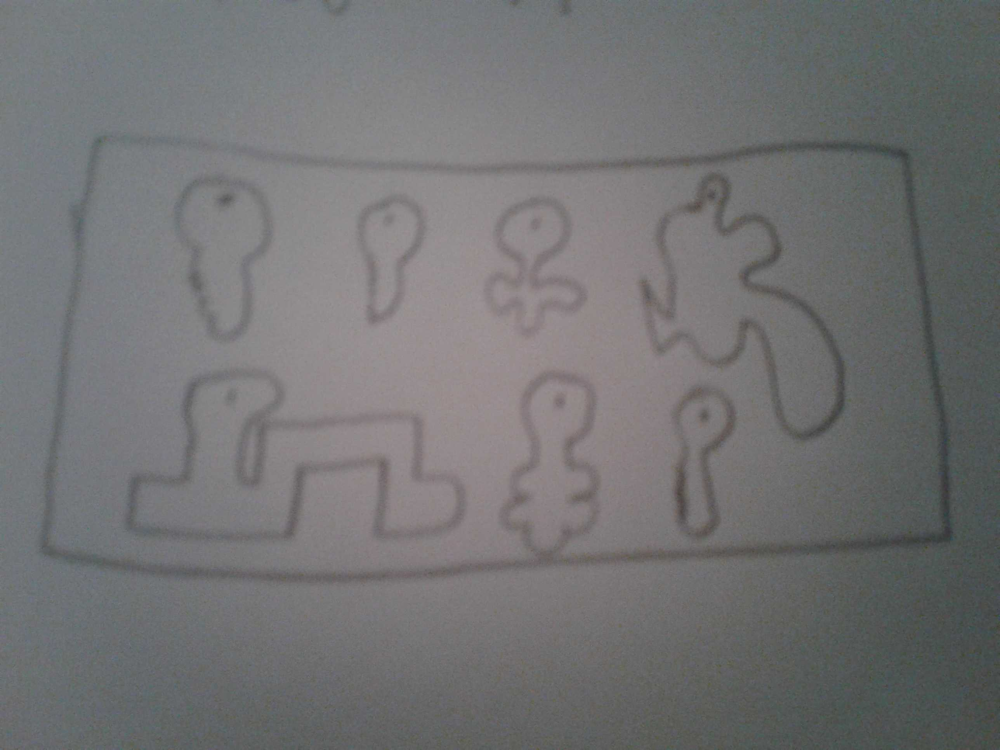

# Jargon Visualized

Jargon (or not-so-jargon), visualized.

## Terms
### Resource hog
A computer program that takes up most of your resources.

### Mouse
An input device, for pointing and clicking.

### Keyboard
An input device, for entering text.

### RAMdisk
A temporary storage device, created from random access memory (RAM).

### Linked list
A data structure made up of elements, each having a pointer to the previous and next elements.

